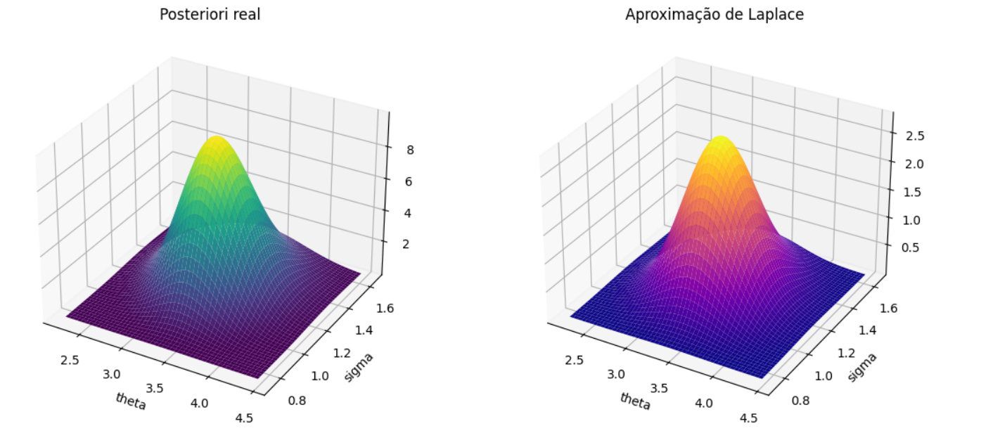

# Projeto Inferência Bayesiana

## Descrição
Repositório criado com estudos da disciplina de Inferência Bayesiana. Contém duas atividades:

### Atividade 1 - Análise do Impacto do Tamanho da Amostra na Inferência Bayesiana


Análise que busca investigar o impacto na estimativa de parâmetros de acordo com o tamanho da amostra observada. Consistiu em escolher um modelo probabilístico e obter prioris não-informativas (Priori de Jeffreys), informativas (conjugada) e hierárquicas. Os tamanhos das amostradas consideradas foram: $n = 5,10,30,100,500$.

#### Modelo Estatístico Escolhido

O modelo estatístico escolhido para a análise foi uma $Poisson(\lambda)$ com $\lambda = 5$. O EMV de $\lambda$ para a Poisson é a média amostral.

$$
p_{x|\lambda}(x|\lambda) = \frac{e^{-\lambda} \lambda^x}{x!}, \,\lambda > 0 \text{ e } x = 1,...,n
$$

As prioris foram:

- Conjugada: $\lambda$ ~ $Gama(\alpha, \beta)$
- Priori de Jeffreys: $p(\lambda) \propto \lambda^{-1/2}$
- Priori hierárquica: $\alpha$ e $\beta$ seguindo exponenciais com parâmetros tais que $\frac{E(\alpha)}{E(\beta)} = 5$. Isto pois a média da gama é $E(\lambda) = \frac{\alpha}{\beta}$ e queremos que o estimador via Bayes seja o mais próximo possível da média amostral (pois o estimador de $\lambda$ para Poisson é $\bar{X}$)

### Atividade 2 - ICs, Teste de Hipóteses e Métodos Computacionais para Simulação



Este projeto busca aplicar métodos computacionais bayesianos para inferir sobre o parâmetro de interesse $\theta$, comparando as abordagens. O modelo observado é

$$
X_i = \theta + \sigma u_i, \,i = 1,...,n,\,\sigma > 0 \text{ desconhecido}
$$

E os erros $u_i$ seguem a distribuição logística padrão:

$$
f(u) = \frac{e^{-u}}{(1 + e^{-u})^2},\,u \in \mathbb{R}
$$

A amostra observada é simulada com $\theta = 3$ e $\sigma = 1.5$.

Assuma prioris independentes:

$$
\theta \text{ ~ } N(0,10^2)
$$

$$
\sigma \text{ ~ } Half-Cauchy(0,5)
$$

Implementa-se métodos de inferência bayesiana para análise de dados, incluindo:

- Cálculo de estimativas posteriores (média, mediana, moda, IC).

Os métodos utilizados foram: 

- Aproximação por Laplace
- Método da Rejeição
- Reamostragem por Importância Ponderada
- Metropolis-Hastings
- Metropolis com Gibbs
- STAN
  
Ao fim, realiza-se uma comparação entre os métodos utilizados usando as métricas EQM (Erro quadrático médio) e ESS (Tamanho efetivo da amostra), bem como taxas de aceitação quando aplicável.

## Instalação

Clone o repositório e instale as dependências (Python):

```bash
git clone https://github.com/aninha-do-ceu/inferencia-bayesiana.git
cd inferencia-bayesiana
pip install -r requirements.txt
